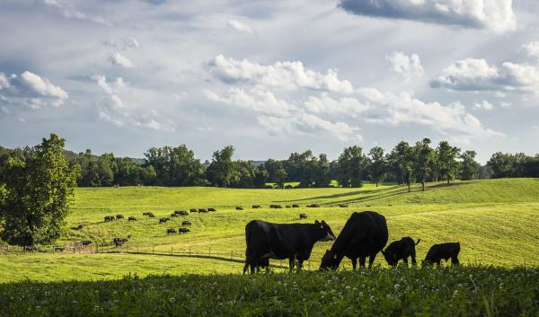

# FloraView

Predicting pasture biomass from field photographs using multi-modal deep learning.

**Live demo:** https://huggingface.co/spaces/kurtisnisbet/FloraView

This project covers the full machine learning lifecycle in two parts: **Part 1 (Modelling)**, from EDA through cloud GPU training and evaluation, and **Part 2 (Deployment)**, packaging the trained models into a live containerised web app ([jump to Part 2](#part-2-deployment)).

<div align="center">
  
</div>

*Image: [USDA Climate Hubs](https://www.climatehubs.usda.gov/hubs/international/topic/virtual-fencing-climate-adaptation-strategy)*

## Overview

Pasture biomass is a critical metric for livestock farm management, but measuring it manually means cutting, drying, and weighing samples in a lab: slow, expensive work. FloraView replaces that with a smartphone photo and one field measurement (average plant height), predicting dry biomass yield in grams directly from the image plus a small set of tabular features.

The model is trained on the CSIRO Pasture Biomass dataset and predicts four biomass components simultaneously:

| Target | Description |
|---|---|
| `Dry_Clover_g` | Dry clover biomass |
| `Dry_Dead_g` | Dry dead material biomass |
| `Dry_Green_g` | Dry green (live) biomass |
| `GDM_g` | Total green dry matter |

**Result:** R² of 0.83 on total green dry matter (the metric farmers care most about), validated with 5-fold cross-validation, and deployed as a sub-3-second inference app on HuggingFace Spaces.

---

## Dataset

- **Source:** CSIRO Pasture Biomass dataset
- **Samples:** 357 field observations across four Australian states (NSW, Vic, Tas, WA)
- **Inputs:** Pasture photograph + tabular features
- **Tabular features:** NDVI (Pre_GSHH_NDVI), average sward height (Height_Ave_cm), Australian state, month, season, and 16 one-hot encoded species indicators (including Ryegrass, Clover, Phalaris, and Subclover varieties)

The raw data arrives as per-species rows; during feature engineering these were pivoted to a wide format with one row per image/observation. EDA also confirmed that the raw `Dry_Total_g` column is a linear sum of the clover, dead, and green components, so it was dropped from the feature set to prevent target leakage.

### Sample images

The photographs are close-range, taken at ground level, and range from dense green clover to dead-material-dominant swards. This visual heterogeneity is both the core challenge and the motivation for a multi-modal approach: the image alone is ambiguous, so structured field measurements carry real signal.

<div align="center">
  
</div>

### Species and geographic distribution

The dataset spans 14 pasture species. Ryegrass dominates, followed by Mixed and Phalaris, with a long tail of rare species.

This imbalance has direct consequences for the model: it sees few examples of minority species during training, so predictions for paddocks dominated by rare species are less reliable. It also helps explain why `Dry_Clover_g` proved harder to predict than `GDM_g`, since clover-dominant observations were underrepresented. One-hot encoding species from the original long-form data lets rare species contribute on the few positive examples they have, rather than being lost in an aggregate category.

<div align="center">
  
</div>

Samples come from four states, with Tas and Vic most heavily represented, and concentrate in Spring and Autumn with limited Winter coverage. State and season were included as features, but thin representation for some state-season combinations means these features may not generalise to unseen combinations. Predictions for undersampled states or seasons should be treated with caution.

<div align="center">
  
</div>

### Target distributions

All four targets are heavily right-skewed and zero-inflated: many observations contain no clover or dead material at all. A log1p transform is applied before training (see [Key design decisions](#key-design-decisions)).

<div align="center">
  
</div>

<div align="center">
  
</div>

### Feature correlations

The strongest relationship is between Dry_Green_g and GDM_g (r=0.88), expected since green biomass dominates total green dry matter. Height_Ave_cm correlates moderately with Dry_Green_g (r=0.65) and GDM_g (r=0.58), confirming height as a useful proxy for live yield.

Dry_Dead_g is largely independent of every other feature (r ≈ 0.10), an early warning that this target would be hard. Dead material likely depends on confounders absent from the data, such as weather history and grazing management. Dry_Clover_g shows a mild negative correlation with Dry_Green_g (r = -0.28), suggesting clover-dominant paddocks tend to carry less overall green biomass.

<div align="center">
  
</div>

---

## Methodology

### Model

[AutoGluon MultiModalPredictor](https://auto.gluon.ai/stable/tutorials/multimodal/index.html) is used for all targets. It fuses image and tabular features in a late-fusion MLP architecture: a pretrained vision encoder processes the image, a separate branch handles tabular features, and the two representations are concatenated before the regression head.

A separate predictor is trained per target. AutoGluon does not natively support multi-output regression, and per-target models also make it possible to ship only the strongest models at deployment time (which mattered, see [Key deployment decisions](#key-deployment-decisions)).

### Key design decisions

**Log1p target transform:** All four targets are right-skewed with zero inflation. Targets are log1p-transformed before training and expm1-reversed at evaluation, which stabilises training and improves RMSE on the original grams scale.

**Backbone comparison:** Three image encoder architectures were benchmarked on identical splits to identify the best feature extractor for pasture imagery, rather than accepting the default untested. The default AutoGluon backbone won on the two highest-signal targets.

**Cross-validation:** With only 357 samples, a single train/val split gives noisy estimates. 5-fold CV was used to quantify both mean performance and its variance across splits.

### Infrastructure

Training ran on Azure ML using a Tesla T4 GPU cluster (`Standard_NC4as_T4_v3`), with MLflow for experiment tracking, including per-fold metrics and aggregate summaries for CV runs. The local notebook pipeline doubles as a CPU smoke test, so jobs were only submitted to the cluster once the pipeline was verified end-to-end. The training script also verifies every image path exists before training begins, failing fast rather than burning GPU hours on a broken data mount.

---

## Results

### Backbone comparison

Three architectures were compared on the same 80/20 train/val split.

<div align="center">
  
</div>

The default AutoGluon backbone performs best overall, particularly on GDM_g and Dry_Green_g. Swin-Base outperforms on the harder, low-signal targets (Dry_Clover_g and Dry_Dead_g).

| Target | Default | Swin-Base | EfficientNet-B4 |
|---|---|---|---|
| Dry_Clover_g | 0.563 | **0.629** | 0.607 |
| Dry_Dead_g | 0.280 | **0.429** | 0.194 |
| Dry_Green_g | **0.726** | 0.626 | 0.614 |
| GDM_g | **0.825** | 0.808 | 0.516 |

### 5-Fold cross-validation

<div align="center">
  
</div>

| Target | R² mean | R² std |
|---|---|---|
| Dry_Clover_g | 0.457 | ± 0.026 |
| Dry_Dead_g | 0.285 | ± 0.080 |
| Dry_Green_g | 0.695 | ± 0.059 |
| GDM_g | 0.726 | ± 0.036 |

The low std on GDM_g and Dry_Green_g confirms these predictions are stable across data splits. The higher std on Dry_Dead_g reflects the difficulty of that target: dead material carries weak visual and tabular signal.

### Predicted vs actual

GDM_g and Dry_Green_g cluster tightest around the perfect-prediction line, consistent with their stronger tabular signal (height and NDVI) identified during EDA. Dry_Dead_g predictions are notably scattered, reflecting its near-zero correlation with every available feature; no amount of feature engineering can compensate for absent signal. Dry_Clover_g performs moderately, with its spread partly attributable to the species imbalance identified earlier.

<div align="center">
  
</div>

### Residuals

Residuals for GDM_g and Dry_Green_g are reasonably centred around zero, suggesting the model is well calibrated for these targets. Dry_Dead_g shows the most erratic pattern, reinforcing that the model cannot separate systematic error from noise here.

One consistent pattern appears across all targets: underprediction at high biomass values. This is a known limitation when training on small, right-skewed distributions where extreme values are underrepresented even after the log1p transform.

<div align="center">
  
</div>

### Total biomass

Summing predictions across all four targets shows the model tracks total biomass well despite weak performance on individual components like Dry_Dead_g. Errors partially cancel: where one component is overpredicted, another tends to be underpredicted, buffering the overall estimate.

The tightest predictions cluster at lower totals, where training data is most dense, while high-biomass observations show greater spread, a direct consequence of the skewed distributions and limited high-yield examples.

<div align="center">
  
</div>

### Interpretation

- **GDM_g** (total green dry matter) is the most predictable target (R²=0.73–0.83), and conveniently the metric most relevant to practical farm management
- **Dry_Dead_g** is the hardest target (R²=0.28–0.43); dead biomass is visually similar to soil and depends on weather history not captured in the data
- The model beats a naive mean-prediction baseline on all four targets across all backbones

---

## Part 2: Deployment

With the models trained and evaluated, the second phase packages them into a live web application that predicts biomass directly from an uploaded photo. **Try it here:** https://huggingface.co/spaces/kurtisnisbet/FloraView

### Inference pipeline (`src/predict.py`)

A standalone module loads the per-target AutoGluon predictors and runs the full prediction path: log1p inputs → `predict` → `expm1` → clip negatives to zero (biomass cannot be negative). Predictions use AutoGluon's `realtime=True` path, a lightweight forward pass that avoids spinning up a full PyTorch Lightning trainer per request, cutting single-image latency to under 3 seconds on CPU.

### Web app (`app.py`, Gradio)

The model is wrapped in a [Gradio](https://www.gradio.app/) interface so it can be used from a browser with no code. The user uploads a pasture photo and enters a few field details (state, month, average plant height, and any known species); the app assembles a model-ready row, defaulting NDVI and imputing a typical ryegrass/clover mix when species are not provided, and returns the predicted biomass. Month is mapped to the southern-hemisphere season automatically, and a per-session history table records each prediction made during a visit.

### Containerisation (Docker)

The app is packaged with Docker for reproducibility. Rather than shipping the full training environment (~300 packages), the image is built from a slim `requirements-inference.txt` that depends on `autogluon.multimodal` alone rather than the full AutoGluon meta-package, avoiding the unused tabular and timeseries AutoML stacks (Ray, LightGBM, CatBoost), and uses the CPU-only PyTorch build to keep the image lean. The ML stack is pinned to the exact training versions because AutoGluon's pickled preprocessors fail to load under version drift. A `.dockerignore` excludes data, secrets, notebooks, and unused models from the build context, and the requirements file is copied before the code so the dependency layer caches across rebuilds.

### Hosting (HuggingFace Spaces)

The container is deployed to a free HuggingFace Space, which builds the Docker image and serves it on CPU hardware. Model checkpoints (hundreds of MB each) are stored via Git LFS.

### Key deployment decisions

The free Space caps repository storage at 1 GB, but the four model checkpoints total ~1.5 GB, forcing a trade-off between coverage and deployability. The demo ships only the two most valuable models, GDM (total green dry matter) and Clover, at ~0.78 GB combined. Because `GDM = Dry_Green + Dry_Clover`, green biomass is derived for free as `GDM − Clover`, so the demo still reports green, clover, and total living biomass from just two models while staying under the limit. Dead biomass, the weakest target (R² ≈ 0.28), is omitted from the hosted demo but remains available in the full model set.

### Running the demo

```bash
# Locally (Python 3.11)
pip install -r requirements-inference.txt
python app.py            # serves at http://localhost:7860

# With Docker
docker build -t floraview .
docker run -p 7860:7860 floraview
```

---

## Project structure

```
FloraView/
├── assets/                    # plots and figures for this README
├── data/
│   ├── raw/                   # CSIRO pasture images + train.csv (not tracked in git)
│   └── processed/
│       ├── df_wide.csv        # pivoted wide format (pre feature engineering)
│       └── df_model.csv       # final model-ready dataset (357 rows × 26 cols)
├── models/                    # trained model checkpoints (not tracked in git)
│   └── azure/                 # best Azure ML run (default backbone, Tesla T4)
├── notebooks/
│   ├── 01_eda.ipynb           # exploratory data analysis
│   ├── 02_feature_engineering.ipynb  # pivot, species encoding, target inspection
│   ├── 03_modelling.ipynb     # local CPU smoke test (120 s per target)
│   ├── 04_azure_ml_job.ipynb  # Azure ML job submission and experiment management
│   └── 05_evaluation.ipynb    # results analysis, backbone comparison, CV summary
├── results/                   # downloaded Azure ML output CSVs and plots
├── src/
│   ├── train.py               # training script (runs on Azure ML GPU cluster)
│   └── predict.py             # inference pipeline used by the demo app (Part 2)
├── app.py                     # Gradio web app (Part 2)
├── Dockerfile                 # container build for deployment
├── .dockerignore
├── requirements.txt           # full training environment
├── requirements-inference.txt # slim dependencies for the demo image
└── .env                       # Azure credentials (not committed to git)
```

---

## Reproducing the experiments

### Prerequisites

- Python 3.11
- An Azure ML workspace with a GPU compute cluster (tested on `Standard_NC4as_T4_v3`, Tesla T4)
- Azure CLI installed and authenticated (`az login`)

### Setup

```bash
git clone https://github.com/kurtisnisbet/FloraView.git
cd FloraView
py -3.11 -m venv .venv
.venv\Scripts\activate          # Windows
pip install -r requirements.txt
```

Create a `.env` file in the project root:

```
AZURE_SUBSCRIPTION_ID=<your-subscription-id>
AZURE_RESOURCE_GROUP=<your-resource-group>
AZURE_WORKSPACE_NAME=<your-workspace-name>
```

### Running notebooks

Run notebooks in order from `notebooks/`:

1. `01_eda.ipynb`: explore the raw data
2. `02_feature_engineering.ipynb`: produce `df_model.csv`
3. `03_modelling.ipynb`: local smoke test to verify the pipeline end-to-end
4. `04_azure_ml_job.ipynb`: submit training jobs to Azure ML
5. `05_evaluation.ipynb`: analyse results

> **Note:** Raw image data is not included in this repository due to size. Contact CSIRO for dataset access.

### Training script arguments

`src/train.py` accepts the following arguments when submitted as an Azure ML job:

| Argument | Default | Description |
|---|---|---|
| `--data_path` | required | Path to mounted data asset |
| `--time_limit` | 14400 | Seconds per target per fold |
| `--backbone` | None | timm backbone name (None = AutoGluon default) |
| `--n_folds` | 1 | Number of CV folds (1 = standard split) |

---

## Limitations and future work

- **Dataset size:** 357 samples is small for deep learning. Additional labelled images, particularly for underrepresented species and seasons, would likely improve all targets.
- **Dry_Dead_g ceiling:** Dead biomass prediction appears near its ceiling with current inputs. Features such as time-since-rain or spectral indices may help.
- **Deployment:** A live demo is available (see [Part 2](#part-2-deployment)). Next steps include fitting all four models within the hosting storage limit (e.g. by compressing checkpoints) and reducing CPU inference latency.
- **Temporal generalisation:** The current split does not account for temporal structure. A time-based split would give a stricter estimate of out-of-sample performance.

---

## Technologies

Python · AutoGluon · PyTorch · Azure ML · MLflow · scikit-learn · pandas · matplotlib · Gradio · Docker · HuggingFace Spaces · Git LFS
