# image2biomass


Predicting pasture biomass from field photographs using multi-modal deep learning.

---

<div align="center">
  
</div>

*Image: [USDA Climate Hubs](https://www.climatehubs.usda.gov/hubs/international/topic/virtual-fencing-climate-adaptation-strategy)*

## Overview

Pasture biomass measurement is critical for livestock farm management but is expensive and time-consuming when done manually. This project builds a machine learning pipeline that predicts dry biomass yield (in grams) from smartphone images of pasture combined with tabular field measurements.

The model is trained on the CSIRO Pasture Biomass dataset and predicts four biomass components simultaneously:

| Target | Description |
|---|---|
| `Dry_Clover_g` | Dry clover biomass |
| `Dry_Dead_g` | Dry dead material biomass |
| `Dry_Green_g` | Dry green (live) biomass |
| `GDM_g` | Total green dry matter |

---

## Dataset

- **Source:** CSIRO Pasture Biomass dataset
- **Samples:** 357 field observations across multiple Australian states (NSW, VIC, TAS, SA, WA)
- **Inputs:** Pasture photograph + tabular features
- **Tabular features:** NDVI (Pre_GSHH_NDVI), average sward height (Height_Ave_cm), Australian state, month, season, and one-hot encoded species presence (14 pasture species including Ryegrass, Clover, Phalaris, SubClover, and others)

The raw data consists of per-species rows that were pivoted to a wide format (one row per image/observation) during feature engineering.

### Sample images

The dataset for this project contains close-range photographs of pasture taken at ground level, ranging from dense green clover to dead-material dominant images.

This visual heterogeneity is both the core challange and motivation for the multi-modal approach used in this project.

<div align="center">
  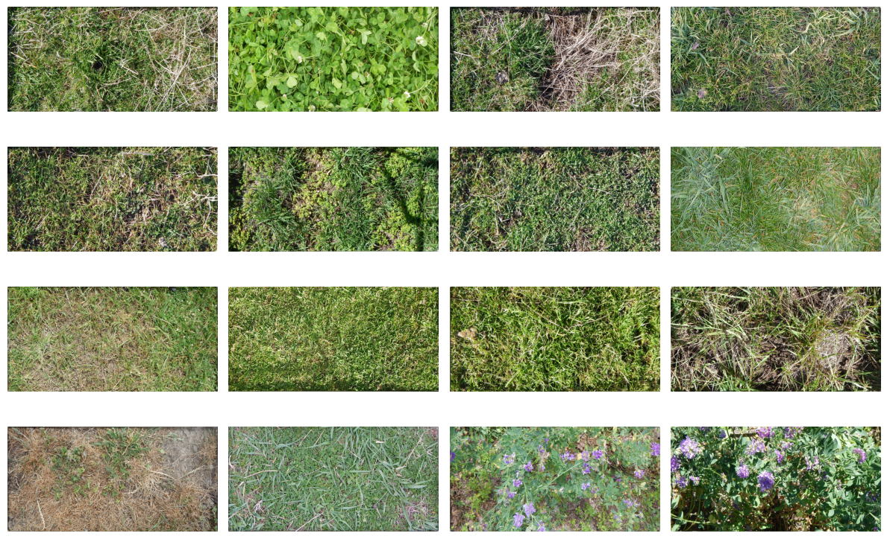
</div>

### Species and geographic distribution

The dataset spans 14 pasture species.

Ryegrass is the most frequently observed, followed by Mixed and Phalaris, with some rare species. 

This imbalance has has implications for model performance i.e. the model sees relatively few examples of minority species during training, meaning predictions for paddocks dominated by rare species are likely less reliable, and may explain why Dry-Cover_g was harder to predict than GDM_g, as clover-dominant observations were underrepresented in training.

To account for this, during feature engineering, species were one-hot encoded from the original long-form data to allow rare species to contribute on the few positive examples across the dataset.

<div align="center">
  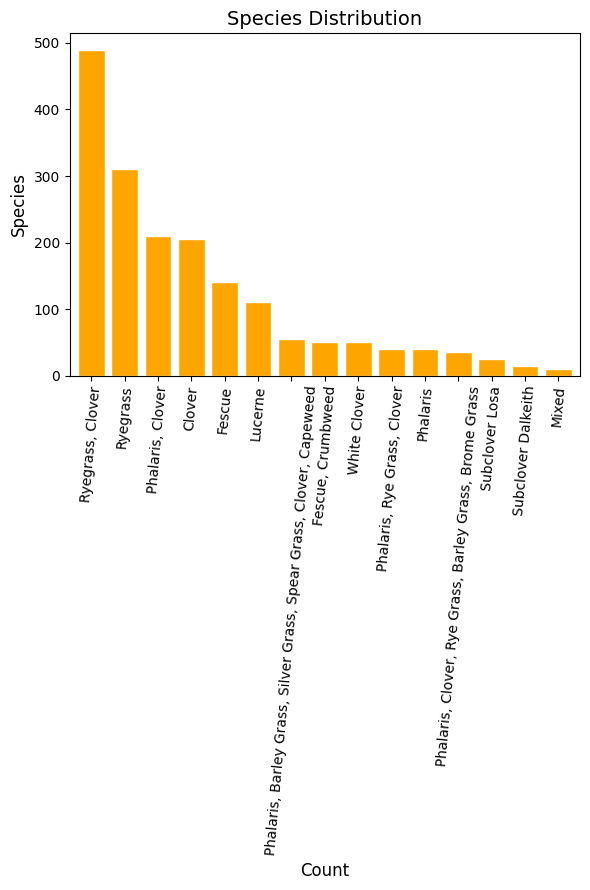
</div>

Samples are drawn from five Australian states, with NSW and Tas being the most heavily represented. The heatmap shows most observations fall in Spring and Autumn, with limited coverage in Winter.

State and seasons were included as features during engineering, however with thin representation for some state-season combinations, these features may not generalise well due to unseen combinations.

This introduces potential geographic and seasonal bias, where the model underperforms on paddocks from undersampled states or seasons and should be treated with caution.

<div align="center">
  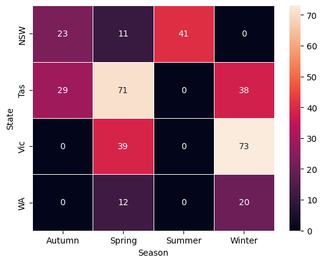
</div>

### Target distributions

Targets are heavily right-skewed with zero inflation with many observations have zero clover or dead material. A log1p transform is applied before training.

<div align="center">
  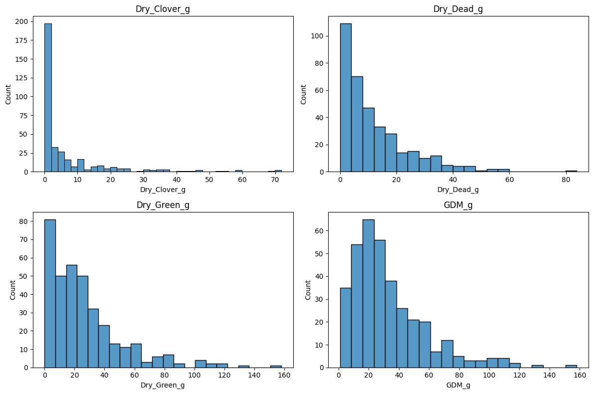
</div>

<div align="center">
  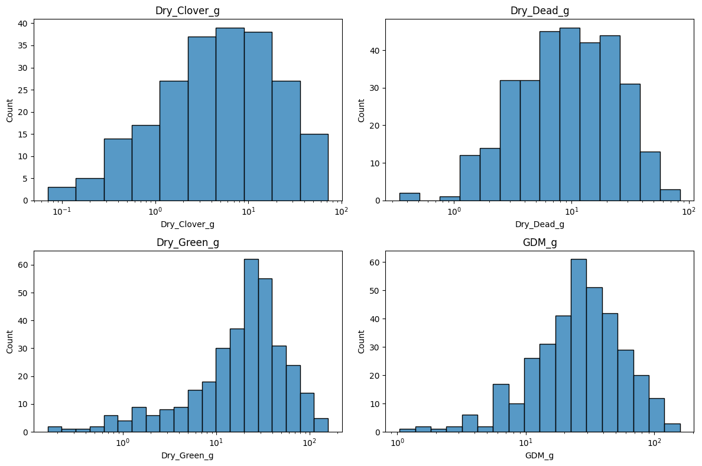
</div>

### Feature correlations

The strongest relationships in the dataset are between Dry_Green_g and GDM_g (r=0.88), which is expected since green biomass is the dominant component of total green dry matter. Height_Ave_cm correlates moderately with Dry_Green_g (r=0.65), and GDM_g (r=0.58), confirming height is a useful proxy for live biomass yield. 

Dry_Dead_g is largely independent of all other features (r = 0.10), consistent with its poor model performance. This may be due to confounding variables, such as impacts by weather history, or grazing management rather than visual and structural features available in the dataset. 

Dry_Clover_g shows a mild negative correlation with Dry_Green_g (r = -0.28), suggesting clover-dominant paddocks tend to have less overall green biomass.

<div align="center">
  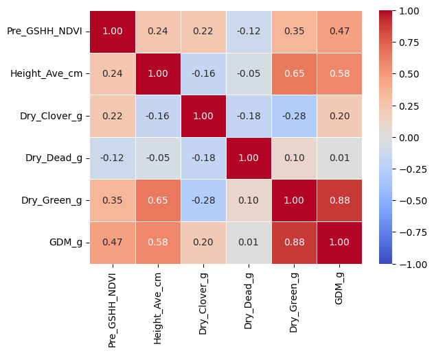
</div>

---

## Methodology

### Model

[AutoGluon MultiModalPredictor](https://auto.gluon.ai/stable/tutorials/multimodal/index.html) is used for all targets. It fuses image and tabular features in a late-fusion MLP architecture, a pretrained vision encoder processes the image, a separate branch handles tabular features, and both representations are concatenated before the final regression head.

A separate predictor is trained per target. AutoGluon does not natively support multi-output regression, so this is the recommended approach.

### Key design decisions

**Log1p target transform:** All four targets are right-skewed with zero inflation. Targets are log1p-transformed before training and expm1-reversed at evaluation, which stabilises training and improves RMSE on the original grams scale.

**Backbone comparison:** Three image encoder architectures were compared to identify the best feature extractor for pasture imagery. The default AutoGluon backbone outperformed alternatives on the two highest-R² targets.

**Cross-validation:** Given the small dataset size (357 samples), 5-fold CV was used to obtain more reliable performance estimates than a single train/val split.

### Infrastructure

Training was run on Azure ML using a Tesla T4 GPU cluster (`Standard_NC4as_T4_v3`), providing speedup over local CPU. MLflow was used for experiment tracking and run comparison.

---

## Results

### Backbone comparison

Three architectures were compared on the same 80/20 train/val split.

<div align="center">
  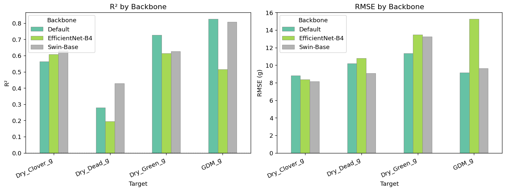
</div>

The default AutoGluon backbone performs best overall, particularly on GDM_g and Dry_Green_g. Swin-Base outperforms on the harder, low-signal targets (Dry_Clover_g and Dry_Dead_g).

| Target | Default | Swin-Base | EfficientNet-B4 |
|---|---|---|---|
| Dry_Clover_g | 0.563 | **0.629** | 0.607 |
| Dry_Dead_g | 0.280 | **0.429** | 0.194 |
| Dry_Green_g | **0.726** | 0.626 | 0.614 |
| GDM_g | **0.825** | 0.808 | 0.516 |


### 5-Fold cross-validation

<div align="center">
  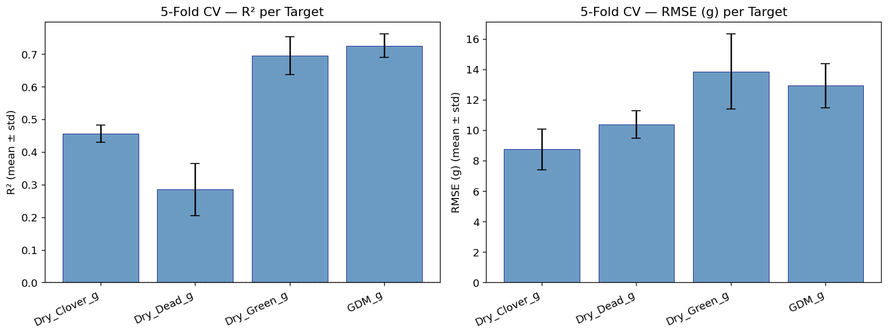
</div>

The low std on GDM_g and Dry_Green_g confirms these predictions are stable across different data splits. The higher std on Dry_Dead_g reflects the difficulty of that target — dead material has weak visual and tabular signal.

| Target | R² mean | R² std |
|---|---|---|
| Dry_Clover_g | 0.457 | ± 0.026 |
| Dry_Dead_g | 0.285 | ± 0.080 |
| Dry_Green_g | 0.695 | ± 0.059 |
| GDM_g | 0.726 | ± 0.036 |


### Predicted vs actual

GDM_g and Dry_Green_g show the tightest clustering around the perfect prediction line, consistent with their stronger tabular signal (height and NDVI) identified during EDA. 

Dry_Dead_g predictions are notably scattered, reflecting its near-zero correlation with all available features, so our feature engineering could not compensate for the absence of meaningful signal.

Dry_Clover_g performs moderately, though its spread is partly attributable to the species imbalance identified earlier.

<div align="center">
  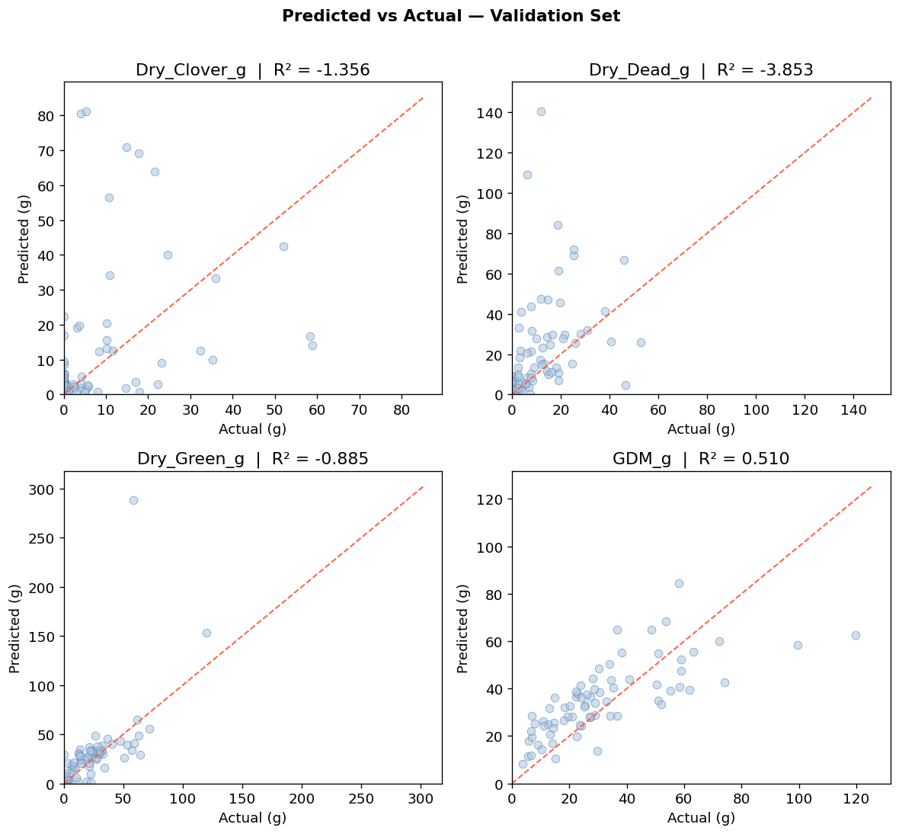
</div>

### Residuals

Residuals for GDM_g and Dry_Green_g are reasonably centred around zero, suggesting the model is well-calibrated for these targets. 

Dry_Dead_g shows the most erratic residual pattern, reinforcing that the model struggles to distinguish systematic error from noise for this target. 

A consistent pattern of underprediction at high biomass values is visible across all targets, a known limitation when training on small, right-skewed distributions where extreme values are underrepresented even after log1p transformation.

<div align="center">
  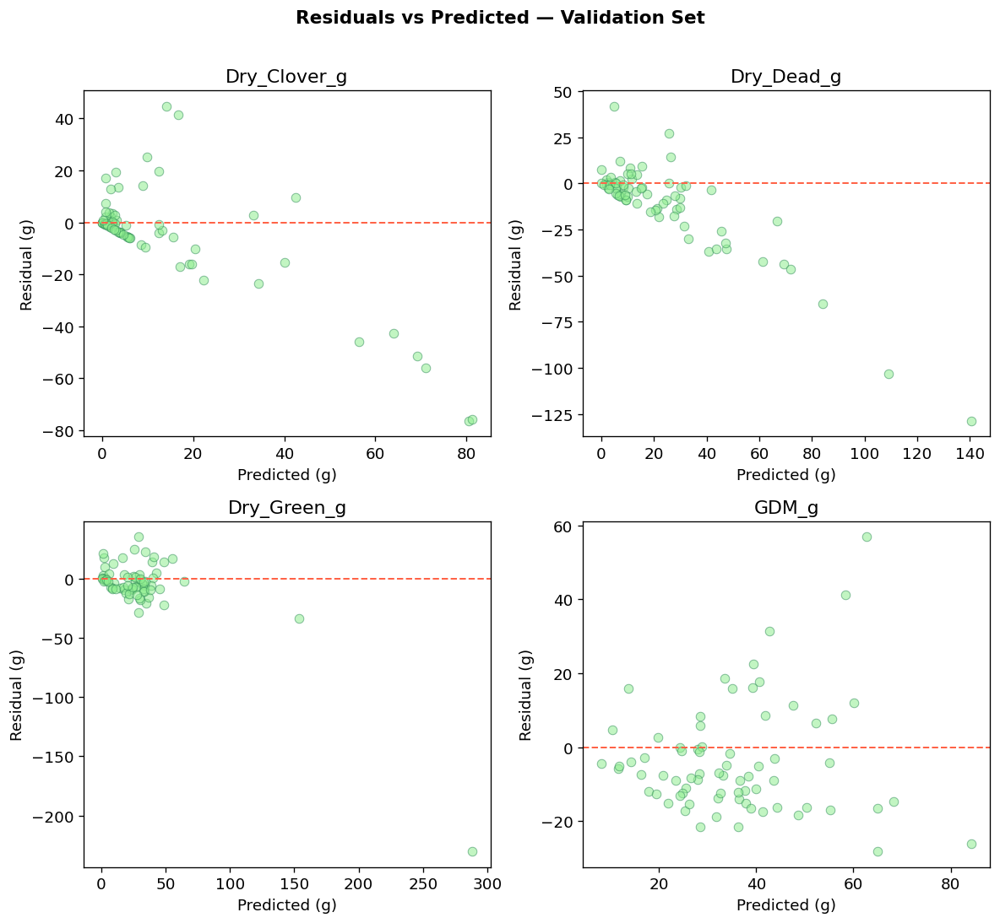
</div>

### Total biomass

Total biomass (sum of all four predicted targets) vs actual.

By summing predictions across all four targets, we can see the model tracks total biomass reasonably well despite the weak performance on individual components like Dry_Dead_g. 

This suggests errors partially cancel out across targets where one component is overpredicted, another tends to be underpredicted, buffering the overall estimate. 

The tightest predictions cluster at lower total biomass values, where the training data is most dense, while higher-biomass observations show greater spread — a direct consequence of the right-skewed distributions identified during EDA and the limited number of high-yield examples available for training.

<div align="center">
  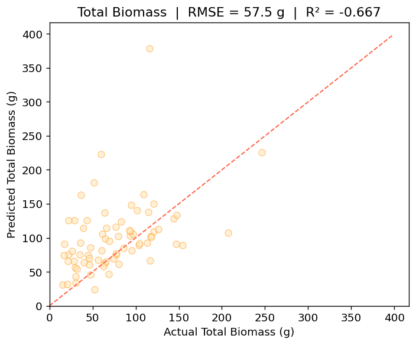
</div>

### Interpretation

- **GDM_g** (total green dry matter) is the most predictable target (R²=0.73–0.83), which is the metric most relevant to practical farm management
- **Dry_Dead_g** is the hardest target (R²=0.28–0.43) — dead biomass has limited visual distinction from soil and varies with weather history
- The model beats a naive mean-prediction baseline on all four targets across all backbones

## Summary

Pasture biomass is a critical metric for livestock farm management, but is costly to measure manually.

This project built a multi-modal deep learning pipeline which predicts dry biomass yield across four metrics, i.e. clover, dead material, live green, and total green dry matter.

This model uses smartphone photogrpahs for pasture, combined with tabular field measurements, i.e. NDVI, sward height, species composition, and geographic metadata, using  AutoGluon's image and tabular features in a late-fusion architecture, and trained on Azure ML GPU infrastructure with MLFlow experiment tracking.

The best-performing configuration achieves an R² of 0.83 on total green dry matter, and a 0.73 on live green biomass, with cross-validation confirming stable generalisations across data splits.

---

## Project structure

```
image2biomass/
├── assets/                    # plots and figures for this README
├── data/
│   ├── raw/                   # CSIRO pasture images + train.csv (not tracked in git)
│   └── processed/
│       ├── df_wide.csv        # pivoted wide format (pre feature engineering)
│       └── df_model.csv       # final model-ready dataset (357 rows × 26 cols)
├── models/                    # trained model checkpoints (not tracked in git)
│   └── azure_default/         # best Azure ML run (default backbone, Tesla T4)
├── notebooks/
│   ├── 01_eda.ipynb           # exploratory data analysis
│   ├── 02_feature_engineering.ipynb  # pivot, species encoding, target inspection
│   ├── 03_modelling.ipynb     # local CPU smoke test (120 s per target)
│   ├── 04_azure_ml_job.ipynb  # Azure ML job submission and experiment management
│   └── 05_evaluation.ipynb    # results analysis, backbone comparison, CV summary
├── results/                   # downloaded Azure ML output CSVs and plots
├── src/
│   └── train.py               # training script (runs on Azure ML GPU cluster)
├── requirements.txt
└── .env                       # Azure credentials — not committed to git
```

---

## Reproducing the experiments

### Prerequisites

- Python 3.11
- An Azure ML workspace with a GPU compute cluster (tested on `Standard_NC4as_T4_v3`, Tesla T4)
- Azure CLI installed and authenticated (`az login`)

### Setup

```bash
git clone https://github.com/<your-username>/image2biomass.git
cd image2biomass
py -3.11 -m venv .venv
.venv\Scripts\activate          # Windows
pip install -r requirements.txt
```

Create a `.env` file in the project root:

```
AZURE_SUBSCRIPTION_ID=<your-subscription-id>
AZURE_RESOURCE_GROUP=<your-resource-group>
AZURE_WORKSPACE_NAME=<your-workspace-name>
```

### Running notebooks

Run notebooks in order from `notebooks/`:

1. `01_eda.ipynb` — explore the raw data
2. `02_feature_engineering.ipynb` — produce `df_model.csv`
3. `03_modelling.ipynb` — local smoke test to verify the pipeline end-to-end
4. `04_azure_ml_job.ipynb` — submit training jobs to Azure ML
5. `05_evaluation.ipynb` — analyse results

> **Note:** Raw image data is not included in this repository due to size. Contact CSIRO for dataset access.

### Training script arguments

`src/train.py` accepts the following arguments when submitted as an Azure ML job:

| Argument | Default | Description |
|---|---|---|
| `--data_path` | required | Path to mounted data asset |
| `--time_limit` | 14400 | Seconds per target per fold |
| `--backbone` | None | timm backbone name (None = AutoGluon default) |
| `--n_folds` | 1 | Number of CV folds (1 = standard split) |

---

## Limitations and future work

- **Dataset size:** 357 samples is small for deep learning. Collecting additional labelled images, particularly for underrepresented species and seasons, would likely improve all targets.
- **Dry_Dead_g ceiling:** Dead biomass prediction appears near its ceiling with current inputs. Additional features such as time-since-rain or spectral indices may help.
- **Deployment:** The trained models are not yet deployed. A natural next step is a simple inference API or mobile-friendly interface that accepts a photo and returns biomass predictions.
- **Temporal generalisation:** The current train/val split does not account for temporal structure. A time-based split would give a stricter estimate of out-of-sample performance.

---

## Technologies

Python · AutoGluon · PyTorch · Azure ML · MLflow · scikit-learn · pandas · matplotlib
